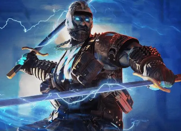
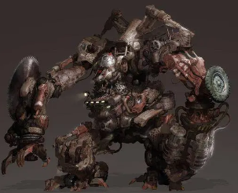
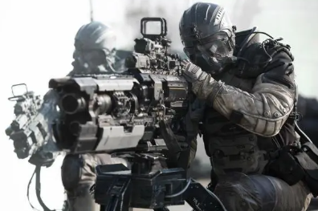
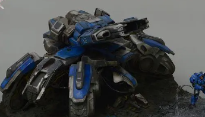

### 军队角色

###### 幽灵猎手

生命值:3/3.

电刃风暴:丢弃你的所有手牌(至少一张牌),指定任意个角色,对这些角色各造成一点伤害.

镭眼:你的回合开始时,你可以查看一个角色的所有手牌.

猎杀计划:当你的攻击被抵消后,你可以指定一名角色再使出攻击(对方可拒绝).

先期准备:回合开始,你可以将一张手牌放入 <备用>.

<备用>中的牌不能被使用,不能丢弃,不计入手牌数,在下个回合开始时全部置入手牌.

###### 废土机甲

生命值6/6

军用型号:每当你使用一张军队卡牌,你获得一张零件.

勘探臂:回合结束时,如果本回合你没有使用3张以上的牌,你可以获得一张零件.

[零件]牌:你可以作为筑防,你可以作为攻击,你可以作为防御.

###### 精英特战队

生命值:4/4

步战协同:你每使用两张牌,摸一张军队牌.

###### 幽灵

生命值:2/2

隐匿:每个回合你遭受到的第一个伤害无效.

伏杀:你的攻击无法被抵消.

独狼:你无法使用[筑防]

备用体<限定技>:你死亡后,直接恢复所有生命值,获得技能<阻击>

阻击:造成的伤害+1.

###### 攻城坦克

生命值:6/6

累重:无法使用攻击,防御,无法回复生命值.

驻地:每个回合可额外摸一张军队牌.

炮击:对一名角色造成2点伤害.随机弃置该角色装备区的一张牌.
